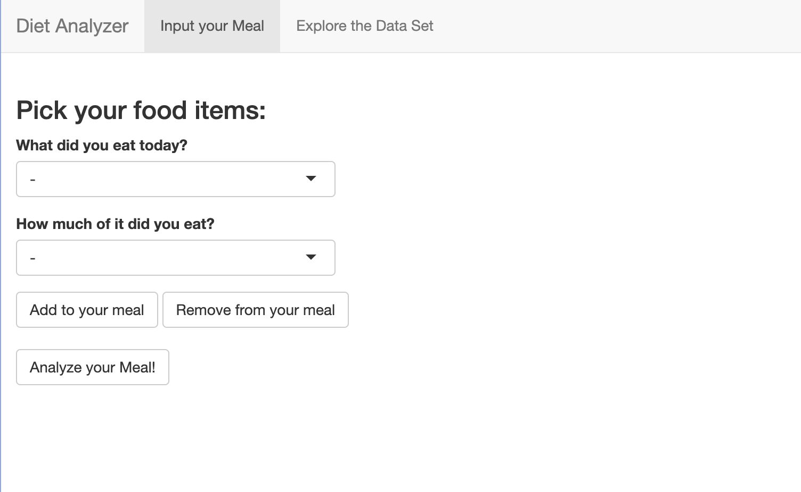

```{r}
#| label: setup
#| include: false
library(mosaic)   
library(tidyverse)
library(mdsr)
library(CanadianNutrient)
library(stringr)
```

## Introduction

Imagine if you had a personal dietitian with you at all times that analyzes all your meals, tracks your diet and helps you achieve your health goals. Somewhat expensive right? And maybe even annoying, if he follows you around everywhere!! What if we told you that in this project we did exactly that, except we replaced the dietitian with a free, accessible, interactive app.  If you are interested in reaching your diet milestones or exploring how data science is implemented to create a personalized diet analyzer then you are in the right place.

\
The purpose of this project is to help people to visualize what they eat on a particular day in terms of their nutrients intake while also quantifying how 'balanced' their diet is. We aim to make it easier for people to identify patterns in their eating habits and adapt their diet with their personal health preferences. Diving into more detail, by inputting their meal in the app, the user would receive a detailed analysis of the macronutrients that he consumed, a visual representation of the balance of his diet as well as a comparison between his meal and six baseline diets (athlete, health nut, normal etc.). Our project strives to provide answers to some of the most common questions regarding nutrition like “How can I eat like an athlete?”, “Is my diet balanced?”, or even “How much fat did I eat today?”.

\

## Data Set

The foundations of a data heavy project like the diet analyzer, lie on the selection of the right, reliable, data set. Specifically, to assure this, we sourced our data set from the data is plural website. It is called Canadian Nutrient and it is a relational database that provides information about food descriptions, food groups, nutrients, as well as a method for calculating the amounts of these nutrients for different quantities of food. The data set contains 12 tables in a csv format which were already documented and loaded as an R package (https://www.canada.ca/en/health-canada/services/food-nutrition/healthy-eating/nutrient-data/canadian-nutrient-file-2015-download-files.html).

\
\
[Paragraph on the data wrangling done in the data set , some code to showcase how to access the data package, and a link to the explore the data package shiny app]{.underline}

## Project Description

### Shiny App

As explained above the final product of the project is an interactive shiny app that lets the user effortlessly select his meal and receive feedback on his diet. In order to demonstrate the app's functionality, let's take a step by step approach to explore the app’s user interface.

 




The user would first come across the meal selector widget. Displayed as a dropdown button with an interactive search bar, it lets the user easily select the meal they had during the day by choosing one food item at a time. Once a food item is selected, (eg. Chicken Parmesan, and Greek Yogurt), the user will be able to choose the quantity of specific food he consumed from the ones available in the data set (eg. 1 serving and 125 ml). From here, the user can proceed to add the food item to his meal. The user’s meal is exhibited as a table making it easy for the user to understand. If the user makes a mistake, he can simply remove the unwanted food item by selecting it and clicking the remove from your meal button. 

\


\

Once the user has selected his meal, he can then press the 'Analyze your meal button', which behind the scenes will calculate the amount of protein, fats and carbohydrates that his meal consists of depending on how much of each food item he consumed. In action, the app will present a table showcasing these findings in the form of a table while arranging the three nutrients in descending order. To give the user a clear understanding of his meal analysis the app will produce a pie chart of the proportions of these nutrients in your meal. In addition to the chart the user will be able to see the highest amounts of nutrients in his meal (through a table arranged in descending order). Lastly, since one of the project’s main purposes was to compare the user’s diet with specific baseline diets, the user will also get feedback on the specific baseline diet that his meal matched with.

\


\
\

Finally, the last widget of the user interface will focus on helping the user reach his nutritional goals by comparing his meal with his desired baseline diet. Specifically, the user will be able to choose one of the baseline diets and compare his nutrient intake with the average person in that diet in a side by side bar chart giving him a clear view on whether he should increase or decrease his consumption of a certain nutrient. This will be done with the help of a dropdown button where the user will be able to select the diet that he wants to compare his meal with and by clicking the action button compare diet.

\


The user will also have the ability to explore our data set by clicking the explore data set button on the top right. He would then be able to look around all the twelve tables of the data set and even use a search bar to find specific nutrients or food items that he desires.


### Data Wrangling

\
To develop the Diet Analyzer Shiny app, extensive data wrangling was necessary. This involved organizing, cleaning, and transforming raw dietary data into a format suitable for analysis and visualization. Specifically, the data wrangling process included tasks such as joining tables, handling missing values, standardizing units of measurement, replacing characters, and ensuring data integrity. By performing these data wrangling steps, we were able to prepare a clean and structured dataset that served as the foundation for the Diet Analyzer app, enabling users to efficiently analyze and gain insights into their dietary habits.

\

[explain/expand this a bit more with examples]{.underline}

\

We also created six different baseline diets based on the proportions of macronutrients (protein, fat and carbohydrates) that each diet generally follows.These diets are athlete, normal, health nut, fast food lover, dessert lover, and carnivore diet. We displayed each diet in each own tibble as you can see below.

\

```{r}

#baseline diets
athlete <- tibble(
  nutrient_name = c("PROTEIN", "FAT (TOTAL LIPIDS)", "CARBOHYDRATE, TOTAL (BY DIFFERENCE)"),
  proportions = c(20.0, 30.0, 50.0)
)


normal <- tibble(
  nutrient_name = c("PROTEIN", "FAT (TOTAL LIPIDS)", "CARBOHYDRATE, TOTAL (BY DIFFERENCE)"),
  proportions = c(15.0, 27.5, 57.5)
)

healthnut <- tibble(
  nutrient_name = c("PROTEIN", "FAT (TOTAL LIPIDS)", "CARBOHYDRATE, TOTAL (BY DIFFERENCE)"),
  proportions = c(17.5, 27.5, 55.0)
)

fastfoodlover<- tibble(
  nutrient_name = c("PROTEIN", "FAT (TOTAL LIPIDS)", "CARBOHYDRATE, TOTAL (BY DIFFERENCE)"),
  proportions = c(15.0, 37.5, 47.5)
)

carnivore <- tibble(
  nutrient_name = c("PROTEIN", "FAT (TOTAL LIPIDS)", "CARBOHYDRATE, TOTAL (BY DIFFERENCE)"),
  proportions = c(30, 52.5, 17.5)
)

dessertlover <- tibble(
  nutrient_name = c("PROTEIN", "FAT (TOTAL LIPIDS)", "CARBOHYDRATE, TOTAL (BY DIFFERENCE)"),
  proportions = c(7.5, 32.5, 60.0)
)

athlete
normal
dessertlover
healthnut
fastfoodlover
carnivore
```

### Functions

Once our data was ready to use, we created the functions necessary for the app. In more depth, we built the following functions: analyze meal, quantify nutrients, food group proportions, baseline diets, sum of squared errors, and diet fit. Explore below what each of the functions functionality was and how we assembled them.

\
\
The analyze meal function gets the user's meal as input and returns the quantities of the protein, fats, and carbohydrates of the meal as well as the proportions of these macronutrients. Since all we have is the name of the food and name of the measure passed as input by the user, a lot of the code entails joining to the other tables in this highly relational data set. We get the nutrient values for these food items, selecting only those nutrients we care about, and then make use of the conversion factor scaling depending on the measure specified by the user. After getting these values, we sum thedm yp throughout all the food items in the meal to get the proportions of these macronutrients present in the meal. See the code below for the data wrangling required for this function.  

```{r}
# Get the value of macro nutrients of our meal 

analyse_meal <- function(Meal) {
  Nutrients <- Meal |> 
  inner_join(FoodNames, by = 'food_description') |> 
  inner_join(NutrientAmounts, by = 'food_id') |> 
  inner_join(NutrientNames, by = 'nutrient_id') |> 
  filter(nutrient_name == 'PROTEIN' | nutrient_name == 'FAT (TOTAL LIPIDS)' | nutrient_name == 'CARBOHYDRATE, TOTAL (BY DIFFERENCE)') |> 
  inner_join(MeasureNames, by = 'measure_description') |> 
  inner_join(ConversionFactor, by = c('measure_id', 'food_id')) |> 
  mutate(new_value = nutrient_value * conversion_factor_value) |> 
  group_by(nutrient_name) |>
  summarise("value" = sum(new_value)) |>
  mutate(proportions = value * 100 / sum(value)) |> 
  select(nutrient_name, value, proportions) |> 
  arrange(desc(value))
 
  return (Nutrients)
}
```

The quantify nutrients function is used to get the amount of all nutrients for a particular meal. Then the result is a table showing the amount of the nutrient that the meal would contain in descending order, as well as a column showing the units in which it is measured. This function makes it very easy to see the calorie amount of the meal, which is of interest of many people in typical cases. Additionally, if you want to increase your intake of Zinc, Iron, or maybe Vitamin C, this will help you to easily quantify that.

```{r}
# To help us quantify nutrients based on how much of the food the user ate.
quantify_nutrients <- function(meal) {
  myprops <- meal |> 
    inner_join(FoodNames, by = 'food_description') |> 
    inner_join(NutrientAmounts, by = 'food_id') |> 
    inner_join(MeasureNames, by = 'measure_description') |> 
    inner_join(ConversionFactor, by = c('food_id', 'measure_id')) |> 
    mutate(total_nutrient = nutrient_value * conversion_factor_value) |>
    inner_join(NutrientNames, by = 'nutrient_id') |> 
    select(nutrient_name, total_nutrient, nutrient_unit) |> 
    group_by(nutrient_name, nutrient_unit) |> 
    summarise(total_nutrient = sum(total_nutrient)) |> 
    arrange(desc(total_nutrient)) |> 
    select(nutrient_name, total_nutrient, nutrient_unit)
  return (myprops)
}
```

\
\

The food group proportions function takes the user's meal as input and returns the food group category of each food item selected as well as the quantity of each group category. This function is more simple, it categorizes each food item in the meal by its food_group_id entry (categorized by Health Canada). The outcome is a table with the quantity of items in the meal pertaining to each food group. This was made by us for developing and exploration purposes and is not used in the app.

```{r}
# Count items in each food group
food_group_prop <- function(meal) {
  OurFoodGroups <- meal |> 
    inner_join(FoodNames, by = 'food_description') |> 
    inner_join(FoodGroup, by = 'food_group_id') |> 
    group_by(food_group_name) |> 
    summarise("Number of items" = n())
  return (OurFoodGroups)
}
```

\

The Sum of Squared Errors Algorithm is a function that computes the sum of the squared errors between the nutrient proportions of the user's meal and those of a specific baseline diet. This is joined with the find diet fit function to minimize the sum of the squares of the differences, in order to find the baseline diet that is 'closest' or to the trends or observations in the input. Below you can see the function of the coded version of this equation.

```{r}
#sum of squared errors function
sum_squared_errors <- function(props, baseline) {
  props |> inner_join(baseline, by = 'nutrient_name') |> 
    mutate(sq_error = (proportions.x - proportions.y)^2) |> 
    summarise(sum_squared_errors = sum(sq_error))
}
```

\
\
\

Concluding, the find diet fit function combines the sum of squared errors function with the baseline diets in order to  calculate the sum of the squared errors of the user's meal with each baseline diet. The function then proceeds to print the baseline diet that had the smallest least squares solution, or in other words the baseline diet that matched the user's meal.

```{r}
#find the baseline diet that the user's meal belongs in
find_diet_fit <- function(props, athlete, normal,
                          healthnut, dessertlover,
                          carnivore, fastfoodlover) {
  
  best_fit <- 'athlete'
  athlete_err <- sum_squared_errors(props, athlete)
 
  min <- athlete_err
  
  normal_err <- sum_squared_errors(props, normal)
  if (normal_err < min) {
    min <- normal_err
    best_fit <- 'normal'
  }
  
  healthnut_err <- sum_squared_errors(props, healthnut)
  if (healthnut_err < min) {
    min <- healthnut_err
    best_fit <- 'healthnut'
  }
  
  dessertlover_err <- sum_squared_errors(props, dessertlover)
  if (dessertlover_err < min) {
    min <- dessertlover_err
    best_fit <- 'dessertlover'
  }
  
  carnivore_err <- sum_squared_errors(props, carnivore)
  if (carnivore_err < min) {
    min <- carnivore_err
    best_fit <- 'carnivore'
  }
  
  fastfoodlover_err <- sum_squared_errors(props, fastfoodlover)
  if (fastfoodlover_err < min) {
    min <- fastfoodlover_err
    best_fit <- 'fastfoodlover'
  }
  
  return (best_fit)
  
}
```

## Conclusion

In essence, the data package was used exhaustively and we fulfilled the goals that the Nutrient Research Division at Health Canada intended when compiling this data set. As stated in their original documentation, the main token this package has is the measure and conversion factor tables that allow you to calculate the nutrient value of foods for different quantities eaten, and we exploited this advantage massively for creating our application. Using the Diet Analyzer, not only can you interactively choose foods and discover their nutrient contents, but you can also combine many of these to make your own meal in seconds, and compare it visually to other known diets to improve your own eating habits. 

\
The goals that we presented before completing our project were definitely met and the accessibility of the Shiny API was perfect to add the interactive component that we were seeking for. Now it is your turn to explore your eating habits, look into your family renowned recipes or plan ahead into a balanced lifestyle.

While our Diet Analyzer app successfully achieves its primary goals, there are some limitations to acknowledge. Firstly, our dataset could benefit from a broader range of baseline diets, allowing for more comprehensive comparisons and analysis. Additionally, while our focus was primarily on fats, carbohydrates, and protein, expanding our analysis to include more nutrients would provide a more holistic view of dietary choices. Moreover, even though comparing the baseline diets with the users meal using the least square problem provides an accurate solution, implementing a more sophisticated algorithm for comparing baseline diets to user-created meals could also enhance the accuracy of our app's recommendations. Furthermore, although the Shiny API provided excellent accessibility for creating an interactive user experience, we recognize that the app's design could be further improved with the addition of more varied colors and visual elements.

Despite these limitations, we believe that our work is very valuable regarding a person trying to take care of their health, or physique, or even to learn what certain types of diets tend to look like in terms of protein, carbohydrates and fats. It is very easy to choose your own meal and the interactivity as well as the amount of food options and meal combinations really makes it viable to use in a real life scenario and to quickly calculate your meal food group proportions. 

We hope that this project will provide value to people trying to improve their eating habits or people that are happy with their diet and physique and want to keep them stable. If you like data visualization or are a health nut, or both, you might love to use our Diet Analyzer to test different diets or meals. Even if you are a cook and want to try different variations of a dish and see which one you think is more healthy, or as a consumer looking into the future to see what you want to buy at the grocery store for tomorrow's dinner the diet analyzer is for you.

\
\
\
