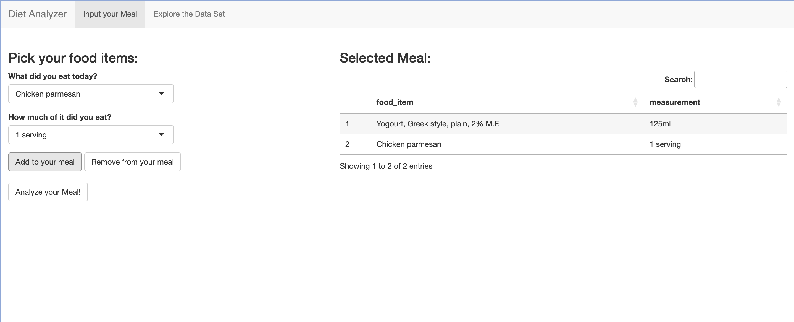
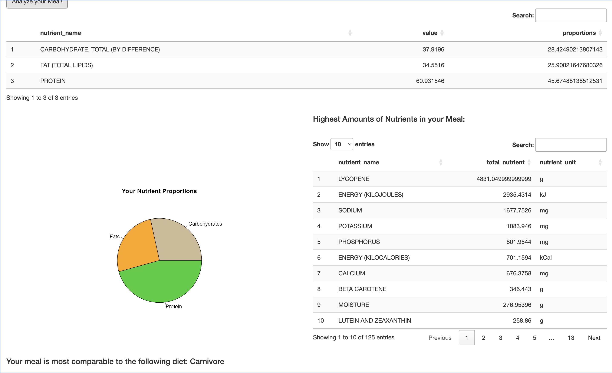

```{r}
#| label: setup
#| include: false
library(mosaic)   
library(tidyverse)
library(mdsr)
library(CanadianNutrient)
library(stringr)
```


\newpage

## Introduction


Purpose 

The goal of this project is to make it easy for people to visualize what they eat in a particular day in terms of their nutrients intake, and also quantify how 'balanced' their diet is. One question we would like to answer is what proportion of a person's meal was in each food group. Additionally, we would like people to be able to input to the program what they ate in the meal and have it say the amounts of each nutrient that they had. People would care about our project since it would be easier for them to find patterns in their eating habits and how to make it healthier perhaps or help them plan meals in advance.

Data

We sourced our data set from the data is plural website. It is called Canadian Nutrient and it is a relational data base that provides information about food descriptions, food groups, nutrients, and a method for calculating the amounts of these nutrients for different quantities of the food. The data set contains 12 tables in a csv format which were already documented and loaded as an R package.

We will not be working with spatial data in shapefiles, or using an API to a live data source. (https://www.canada.ca/en/health-canada/services/food-nutrition/healthy-eating/nutrient-data/canadian-nutrient-file-2015-download-files.html)

Variables: 

 - food: type of food
 - nutrient: name of the nutrient
 - nutrient unit: the unit of measure (g, mg)
 - nutrient quantity: nutrient quantity in nutrient unit per 100 grams of the food
 - measure name: type of quantity used to measure the food
 - conversion factor value: the factor by which me multiply the nutrient quantity per the measure used
 - food group: the general category the group belongs to

End Product

We would hope to create a user interactive app through shiny where the user will input what foods they had eaten in a day and the app will provide the user with an analysis of their diet for that particular day. For example, create a pie chart or other visualization that shows what proportions of different food groups they consumed, and a detailed analysis of how much fat, protein or other specific nutrients they consumed. We would like the user to be able to specify the specific foods and quantities as closely to the ones on the data set to provide accurate data with the conversion factors. For both of these questions, we would like to compare the user's numbers with certain baseline diets, like an athlete, a bodybuilder, a health nut, a dessert or fast food enthusiast. That is, showing the food group proportions of for the corresponding diets, do some sort of calculation to see which one the user is closest too, and maybe provide sample diets or possible improvements to make the diet more balanced or to satisfy your objective diet requirements.

For the Shiny app, we will probably like to have an 'input your meal' section, where the user can type in their foods and match them (with regular expressions in the back end) to the foods in the database. From there, you will see two sections, one with the food group proportion graph, and one with your nutrient intake in descending order. We could still figure out whether we want the baseline diet comparison in the same sections, or if we want another section below those with possible changes and the comparisons.


```{r}
#| include: false

#baseline diets
athlete <- tibble(
  nutrient_name = c("PROTEIN", "FAT (TOTAL LIPIDS)", "CARBOHYDRATE, TOTAL (BY DIFFERENCE)"),
  proportions = c(20.0, 30.0, 50.0)
)


normal <- tibble(
  nutrient_name = c("PROTEIN", "FAT (TOTAL LIPIDS)", "CARBOHYDRATE, TOTAL (BY DIFFERENCE)"),
  proportions = c(15.0, 27.5, 57.5)
)

healthnut <- tibble(
  nutrient_name = c("PROTEIN", "FAT (TOTAL LIPIDS)", "CARBOHYDRATE, TOTAL (BY DIFFERENCE)"),
  proportions = c(17.5, 27.5, 55.0)
)

fastfoodlover<- tibble(
  nutrient_name = c("PROTEIN", "FAT (TOTAL LIPIDS)", "CARBOHYDRATE, TOTAL (BY DIFFERENCE)"),
  proportions = c(15.0, 37.5, 47.5)
)

carnivore <- tibble(
  nutrient_name = c("PROTEIN", "FAT (TOTAL LIPIDS)", "CARBOHYDRATE, TOTAL (BY DIFFERENCE)"),
  proportions = c(30, 52.5, 17.5)
)

dessertlover <- tibble(
  nutrient_name = c("PROTEIN", "FAT (TOTAL LIPIDS)", "CARBOHYDRATE, TOTAL (BY DIFFERENCE)"),
  proportions = c(7.5, 32.5, 60.0)
)

```

```{r}
#| include: false

sum_squared_errors <- function(props, baseline) {
  props |> inner_join(baseline, by = 'nutrient_name') |> 
    mutate(sq_error = (proportions.x - proportions.y)^2) |> 
    summarise(sum_squared_errors = sum(sq_error))
}
```


```{r}
#| include: false


# Wrangling to get the value of each nutrient for our meal and select the nutrients that we care about.

analyse_meal <- function(Meal) {
  Nutrients <- Meal |> 
  inner_join(FoodNames, by = 'food_description') |> 
  inner_join(NutrientAmounts, by = 'food_id') |> 
  inner_join(NutrientNames, by = 'nutrient_id') |> 
  filter(nutrient_name == 'PROTEIN' | nutrient_name == 'FAT (TOTAL LIPIDS)' | nutrient_name == 'CARBOHYDRATE, TOTAL (BY DIFFERENCE)') |> 
  inner_join(MeasureNames, by = 'measure_description') |> 
  inner_join(ConversionFactor, by = c('measure_id', 'food_id')) |> 
  mutate(new_value = nutrient_value * conversion_factor_value) |> 
  group_by(nutrient_name) |>
  summarise("value" = sum(new_value)) |>
  mutate(proportions = value * 100 / sum(value)) |> 
  select(nutrient_name, value, proportions) |> 
  arrange(desc(value))
 
  return (Nutrients)
}


```


```{r}
#| include: false

# To help us quantify nutrients based on how much of the food the user ate.
quantify_nutrients <- function(meal) {
  myprops <- meal |> 
    inner_join(FoodNames, by = 'food_description') |> 
    inner_join(NutrientAmounts, by = 'food_id') |> 
    inner_join(MeasureNames, by = 'measure_description') |> 
    inner_join(ConversionFactor, by = c('food_id', 'measure_id')) |> 
    mutate(total_nutrient = nutrient_value * conversion_factor_value) |>
    inner_join(NutrientNames, by = 'nutrient_id') |> 
    select(nutrient_name, total_nutrient, nutrient_unit) |> 
    group_by(nutrient_name, nutrient_unit) |> 
    summarise(total_nutrient = sum(total_nutrient)) |> 
    arrange(desc(total_nutrient)) |> 
    select(nutrient_name, total_nutrient, nutrient_unit)
  return (myprops)
}


```


```{r}
#| include: false

# Count items in each food group, will find a better way to quantify this
# Would look better with an actual meal rather than three items
food_group_prop <- function(meal) {
  OurFoodGroups <- meal |> 
    inner_join(FoodNames, by = 'food_description') |> 
    inner_join(FoodGroup, by = 'food_group_id') |> 
    group_by(food_group_name) |> 
    summarise("Number of items" = n())
  return (OurFoodGroups)
}
```

```{r}
#| include: false

find_diet_fit <- function(props, athlete, normal, healthnut, 
                          dessertlover, carnivore, fastfoodlover) {
  
  best_fit <- 'athlete'
  athlete_err <- sum_squared_errors(props, athlete)
 
  min <- athlete_err
  
  normal_err <- sum_squared_errors(props, normal)
  if (normal_err < min) {
    min <- normal_err
    best_fit <- 'normal'
  }
  
  healthnut_err <- sum_squared_errors(props, healthnut)
  if (healthnut_err < min) {
    min <- healthnut_err
    best_fit <- 'healthnut'
  }
  
  dessertlover_err <- sum_squared_errors(props, dessertlover)
  if (dessertlover_err < min) {
    min <- dessertlover_err
    best_fit <- 'dessertlover'
  }
  
  carnivore_err <- sum_squared_errors(props, carnivore)
  if (carnivore_err < min) {
    min <- carnivore_err
    best_fit <- 'carnivore'
  }
  
  fastfoodlover_err <- sum_squared_errors(props, fastfoodlover)
  if (fastfoodlover_err < min) {
    min <- fastfoodlover_err
    best_fit <- 'fastfoodlover'
  }
  
  return (best_fit)
  
}


```
 


## Application and Usage

In the end, Diet Analyzer is an application with great ease of use, interactivity and information. The Meal selector is the main widget that comes into play; it lets the user easily select the meal they had during the day by choosing one food item at a time. Once a food item is selected, (eg. Chicken, broiler, light meat and skin, roasted), you will be able to choose the quantity of it that you ate, from the ones available in the data set (eg. 1/2 bird, or 150ml chopped or diced). From here, you can add the food item to your meal and it displays as a table easy for the user to understand. If you make a mistake, you can easily remove it as well. 

Once your meal is finalized, you can press the 'Analyze your meal button', which behind the scenes will calculate the amount of protein, fats and carbohydrates that your meal consumes depending of how much of each thing you ate. The app here will produce a pie chart of the proportions of these nutrients in your meal, as well as running a least squares error algorithm to find a best fit out of the baseline diets we provide for the user. The user will then be able to choose one of the baseline diets to compare their nutrient intake with the average person in that diet in a bar chart, to give them a clear view on whether they should increase or decrease their consumption of a certain nutrient.


## Example

Next up we present an example of how a user will use our application with a sample meal we chose and get informative outputs. The methods used in this section, as well as in our shiny app, can be seen in the Appendix section of this report.

Let's suppose that our user's meal consists of beef pot roast with browned potatoes, peas and corn, fried chicken, and a cheese souffle as a dessert. In the shiny app the user will select the foods that his meal consisted of as well the specific quantities (volume) of each food through a search bar and add them on a table like the one below.

```{r}
# This meal would come from the search bar and the user's input
Meal <- FoodNames |> 
  filter(food_description == 'Cheese souffle' 
  | food_description == 'Beef pot roast, with browned potatoes, peas and corn' 
  | food_description == 'Chicken, broiler, light meat, fried') |> 
  inner_join(ConversionFactor, by = 'food_id') |> 
  inner_join(MeasureNames, by = 'measure_id')  |> 
  filter(measure_description == '250ml' | measure_description == '140g' 
         | measure_description == '100ml chopped or diced')|> 
  select(food_description, measure_description)

Meal 
```


Using the analyse meal function (explained in the appendix) we will calculate the macros of the user's meal. Specifically, the function would print the amount of protein, fats, and carbohydrates in the meal as well as what proportion of the total meal each macro nutrient was. In this particular example, the meal included 58g of protein, 26g of fat, and 21g of carbohydrates. Regarding proportions, the meal would consist of 55% protein, almost 25% fats and 20% carbohydrates.

```{r}
#use analyse meal function to showcase the meals nutrients and their proportions
Nutrients <- analyse_meal(Meal)

Nutrients

```


In order to communicate our findings with the user interactively we are going to visualize the results from the analyse meal function with a pie chart. In more detail, we are going to showcase the meal nutrition proportions for the desired meal. Below you can see the pie chart displaying the macro nutrients proportions for our selected meal: the beef pot roast with browned potatoes, peas and corn, the fried chicken, and the cheese souffle

```{r}

# Pie chart showing the proportions of those nutrient in our meal.

labels = c("Protein", "Total Fat", "Carbohydrates")
pie(Nutrients$value, labels, main = "Diet Nutrient Proportions")
```


To provide additional information about the diversity of the user's diet we are also going to display the food group categories of the meal. This will be done by the food_group_prop function found in the appendix. 
In our example, the fried chicken is considered a poultry product while the beef pot roast, with browned potatoes, peas and corn and a cheese souffle are in the mixed dishes category.
Evidently, the result of the function is more informative when a complete and varied meal is used as the input.

```{r}
#find the food categories and their quantities
OurFoodGroups <- food_group_prop(Meal)

OurFoodGroups

```

The other important aspect to investigate is all other nutrients that can be found in our diet. Perhaps you want to increase your Zinc , Potassium or Vitamin C intake; this following method will help us quantify that. This one is very similar to analyze meal, where it calculates the quantities of nutrients but for all of them and displays them in order. The units are also shown to know how each nutrient in our meal was measured. Very easy to see here is the calorie amount of the meal, which is of interest of many people in typical cases.

```{r}
OurNutrients <- quantify_nutrients(Meal)

OurNutrients
```


Concluding, we would compare the user's meal to different baseline diets (for example athlete, vegan, normal etc.) and using the least squares optimization problem find the baseline diet that is more similar to the users meal. Since in this example the suggested meal was high in protein and a similar amount of carbohydrates and fat the user's meal would be closer to the carnivore diet. This would be particularly helpful for people with nutrition goals that aim to follow a specific baseline diet.

```{r}
#find the baseline diet most similar to the input meal
best_fit <- find_diet_fit(Nutrients, athlete, normal,
            healthnut, dessertlover, carnivore, fastfoodlover)

best_fit

```
 
 
 
 
## Shiny App

As explained above the final product of the project is an interactive shiny app that lets the user effortlessly select his meal and receive feedback on his diet. In order to demonstrate the app's functionality, let's take a step by step approach to explore the app’s user interface.

```{r}
#| fig.cap: " Shiny app Home page"
#| label: home-page
#| echo: false
#| message: false
#| out.width: "80%"
knitr::include_graphics("../Screenshots/homepage.png")
```


The user would first come across the meal selector widget. Displayed as a dropdown button with an interactive search bar, it lets the user easily select the meal they had during the day by choosing one food item at a time. Once a food item is selected, (eg. Chicken Parmesan, and Greek Yogurt), the user will be able to choose the quantity of specific food he consumed from the ones available in the data set (eg. 1 serving and 125 ml). From here, the user can proceed to add the food item to his meal. The user’s meal is exhibited as a table making it easy for the user to understand. If the user makes a mistake, he can simply remove the unwanted food item by selecting it and clicking the remove from your meal button.

```{r}
#| fig.cap: "Select meal procedure "
#| label: select-meal
#| echo: false
#| message: false
#| out.width: "80%"

```


Once the user has selected his meal, he can then press the 'Analyze your meal button', which behind the scenes will calculate the amount of protein, fats and carbohydrates that his meal consists of depending on how much of each food item he consumed. In action, the app will present a table showcasing these findings in the form of a table while arranging the three nutrients in descending order. To give the user a clear understanding of his meal analysis the app will produce a pie chart of the proportions of these nutrients in your meal. In addition to the chart the user will be able to see the highest amounts of nutrients in his meal (through a table arranged in descending order). Lastly, since one of the project’s main purposes was to compare the user’s diet with specific baseline diets, the user will also get feedback on the specific baseline diet that his meal matched with.

```{r}
#| fig.cap: "Analyze meal "
#| label: analyze-meal
#| echo: false
#| message: false
#| out.width: "80%"

```


Finally, the last widget of the user interface will focus on helping the user reach his nutritional goals by comparing his meal with his desired baseline diet. Specifically, the user will be able to choose one of the baseline diets and compare his nutrient intake with the average person in that diet in a side by side bar chart giving him a clear view on whether he should increase or decrease his consumption of a certain nutrient. This will be done with the help of a dropdown button where the user will be able to select the diet that he wants to compare his meal with and by clicking the action button compare diet.


```{r}
#| fig.cap: "Baseline diet comparison "
#| label: baseline-diet-comparison
#| echo: false
#| message: false
#| out.width: "80%"

```


The user will also have the ability to explore our data set by clicking the explore data set button on the top right. He would then be able to look around all the twelve tables of the data set and even use a search bar to find specific nutrients or food items that he desires.

```{r}
#| fig.cap: "Explore CanadianNutrients data set "
#| label: explore-canadianNutrient
#| echo: false
#| message: false
#| out.width: "80%"

```


\newpage

## Evaluation

We believe that our work is very valuable regarding a person trying to take care of their health, or physique, or even to learn what certain types of diets tend to look like in terms of protein, carbohydrates and fats. It is very easy to choose your own meal and the interactivity as well as the amount of foos options and meal combinations really makes it viable to use in a real life scenario and to quickly calculate your meal food group proportions. 

We hope that this project will provide value to people trying to improve their eating habits or people that are happy with their diet and physique and want to keep them stable. If you like data visualization or are a health nut, or both, you might love to use our Diet Analyzer to test different diets or meals. Even if you are a cook and want to try different variations of a dish and see which one you think is more healthy, or as a consumer looking into the future to see what you want to buy at the grocery store for tomorrow's dinner the diet analyzer is for you.


## Limitations

While our Diet Analyzer app successfully achieves its primary goals, there are some limitations to acknowledge. Firstly, our dataset could benefit from a broader range of baseline diets, allowing for more comprehensive comparisons and analysis. Additionally, while our focus was primarily on fats, carbohydrates, and protein, expanding our analysis to include more nutrients would provide a more holistic view of dietary choices. Moreover, even though comparing the baseline diets with the users meal using the least square problem provides an accurate solution, implementing a more sophisticated algorithm for comparing baseline diets to user-created meals could also enhance the accuracy of our app's recommendations. Furthermore, although the Shiny API provided excellent accessibility for creating an interactive user experience, we recognize that the app's design could be further improved with the addition of more varied colors and visual elements.

Despite these limitations, we believe that our work is very valuable regarding a person trying to take care of their health, or physique, or even to learn what certain types of diets tend to look like in terms of protein, carbohydrates and fats. It is very easy to choose your own meal and the interactivity as well as the amount of food options and meal combinations really makes it viable to use in a real life scenario and to quickly calculate your meal food group proportions.

## Conclusion

In essence, the data package was used exhaustively and we fulfilled the goals that the Nutrient Research Division at Health Canada intended when compiling this data set. As stated in their original documentation, the main token this package has is the measure and conversion factor tables that allow you to calculate the nutrient value of foods for different quantities eaten, and we exploited this advantage massively for creating our application. Using the Diet Analyzer, not only can you interactively choose foods and discover their nutrient contents, but you can also combine many of these to make your own meal in seconds, and compare it visually to other known diets to improve your own eating habits.

The goals that we presented before completing our project were definitely met and the accessibility of the Shiny API was perfect to add the interactive component that we were seeking for. Now it is your turn to explore your eating habits, look into your family renowned recipes or plan ahead into a balanced lifestyle.


\newpage
    
## References

::: The Nutrient Research Division, Food Directoriate, Health Products and Food Branch, Health Canada
:::

## Appendix

1. Baseline diets: we created six different baseline diets based on the proportions of macro nutrients (protein, fat and carbohydrates) that each diet generally follows. Below we provide the code and tables with the proportions for each of the following diets: athlete, normal, vegan, fast food lover, dessert lover, and carnivore diet.

```{r}
#baseline diets
athlete <- tibble(
  nutrient_name = c("PROTEIN", "FAT (TOTAL LIPIDS)",
                    "CARBOHYDRATE, TOTAL (BY DIFFERENCE)"),
  proportions = c(30, 20, 50.0)
)


normal <- tibble(
  nutrient_name = c("PROTEIN", "FAT (TOTAL LIPIDS)",
                    "CARBOHYDRATE, TOTAL (BY DIFFERENCE)"),
  proportions = c(25, 25, 50)
)

healthnut <- tibble(
  nutrient_name = c("PROTEIN", "FAT (TOTAL LIPIDS)", 
                    "CARBOHYDRATE, TOTAL (BY DIFFERENCE)"),
  proportions = c(35, 10, 55)
)

fastfoodlover<- tibble(
  nutrient_name = c("PROTEIN", "FAT (TOTAL LIPIDS)", 
                    "CARBOHYDRATE, TOTAL (BY DIFFERENCE)"),
  proportions = c(20, 50, 30)
)

carnivore <- tibble(
  nutrient_name = c("PROTEIN", "FAT (TOTAL LIPIDS)", 
                    "CARBOHYDRATE, TOTAL (BY DIFFERENCE)"),
  proportions = c(60, 30, 10)
)

dessertlover <- tibble(
  nutrient_name = c("PROTEIN", "FAT (TOTAL LIPIDS)", 
                    "CARBOHYDRATE, TOTAL (BY DIFFERENCE)"),
  proportions = c(7.5, 32.5, 60.0)
)

athlete
healthnut
normal
dessertlover
carnivore
fastfoodlover
```


2. Sum of Squared Errors: aiming to compare the user's meal with the baseline diets we decided to use the famus optimization method of the least squares problem. Below you can see the function of the coded version of this equation (sum_squared_errors)

```{r}
#sum of squared errors function
sum_squared_errors <- function(props, baseline) {
  props |> inner_join(baseline, by = 'nutrient_name') |> 
    mutate(sq_error = (proportions.x - proportions.y)^2) |> 
    summarise(sum_squared_errors = sum(sq_error))
}


```


3. Find diet fit Algorithm: combining the functions from appendix 1 and 2, the find diet fit function below calculates the sum of the squared errors of the user's meal each baseline diet. The function then proceeds to print the baseline diet that had the smallest least squares solution, or in other words the baseline diet that matched to users meal.

```{r}
#find the baseline diet that the user's meal belongs in
find_diet_fit <- function(props, athlete, normal,
                          healthnut, dessertlover,
                          carnivore, fastfoodlover) {
  
  best_fit <- 'athlete'
  athlete_err <- sum_squared_errors(props, athlete)
 
  min <- athlete_err
  
  normal_err <- sum_squared_errors(props, normal)
  if (normal_err < min) {
    min <- normal_err
    best_fit <- 'normal'
  }
  
  healthnut_err <- sum_squared_errors(props, healthnut)
  if (healthnut_err < min) {
    min <- healthnut_err
    best_fit <- 'healthnut'
  }
  
  dessertlover_err <- sum_squared_errors(props, dessertlover)
  if (dessertlover_err < min) {
    min <- dessertlover_err
    best_fit <- 'dessertlover'
  }
  
  carnivore_err <- sum_squared_errors(props, carnivore)
  if (carnivore_err < min) {
    min <- carnivore_err
    best_fit <- 'carnivore'
  }
  
  fastfoodlover_err <- sum_squared_errors(props, fastfoodlover)
  if (fastfoodlover_err < min) {
    min <- fastfoodlover_err
    best_fit <- 'fastfoodlover'
  }
  
  return (best_fit)
  
}

```


4. Analyse Meal: the function gets the user's meal as input and returns the quantities of the protein, fats, and carbohydrates of the meal as well as the proportions of these macro nutrients. See the code below for the data wrangling required for this function.

```{r}
# Get the value of macro nutrients of our meal 

analyse_meal <- function(Meal) {
  Nutrients <- Meal |> 
  inner_join(FoodNames, by = 'food_description') |> 
  inner_join(NutrientAmounts, by = 'food_id') |> 
  inner_join(NutrientNames, by = 'nutrient_id') |> 
  filter(nutrient_name == 'PROTEIN' | nutrient_name == 'FAT (TOTAL LIPIDS)' | nutrient_name == 'CARBOHYDRATE, TOTAL (BY DIFFERENCE)') |> 
  inner_join(MeasureNames, by = 'measure_description') |> 
  inner_join(ConversionFactor, by = c('measure_id', 'food_id')) |> 
  mutate(new_value = nutrient_value * conversion_factor_value) |> 
  group_by(nutrient_name) |>
  summarise("value" = sum(new_value)) |>
  mutate(proportions = value * 100 / sum(value)) |> 
  select(nutrient_name, value, proportions) |> 
  arrange(desc(value))
 
  return (Nutrients)
}

```


5. Food Group Proportions: the food_group_prop function takes the user's meal as input and returns the food group category of each food item selected as well as the quantity of each group category.

```{r}

# Count items in each food group
food_group_prop <- function(meal) {
  OurFoodGroups <- meal |> 
    inner_join(FoodGroup, by = 'food_group_id') |> 
    group_by(food_group_name) |> 
    summarise("Number of items" = n())
  return (OurFoodGroups)
}
```

6. Quantify Nutrients: this function is used to get the amount of all nutrients for a particular meal, also as input. Then the result is a table showing the amount of the nutrient that the meal would contain in descending order, as well as a column showing the units in which it is measured. 
```{r}
# To help us quantify nutrients based on how much of the food the user ate.
quantify_nutrients <- function(meal) {
  myprops <- meal |> 
    inner_join(FoodNames, by = 'food_description') |> 
    inner_join(NutrientAmounts, by = 'food_id') |> 
    inner_join(MeasureNames, by = 'measure_description') |> 
    inner_join(ConversionFactor, by = c('food_id', 'measure_id')) |> 
    mutate(total_nutrient = nutrient_value * conversion_factor_value) |>
    inner_join(NutrientNames, by = 'nutrient_id') |> 
    select(nutrient_name, total_nutrient, nutrient_unit) |> 
    group_by(nutrient_name, nutrient_unit) |> 
    summarise(total_nutrient = sum(total_nutrient)) |> 
    arrange(desc(total_nutrient)) |> 
    select(nutrient_name, total_nutrient, nutrient_unit)
  return (myprops)
}

```
